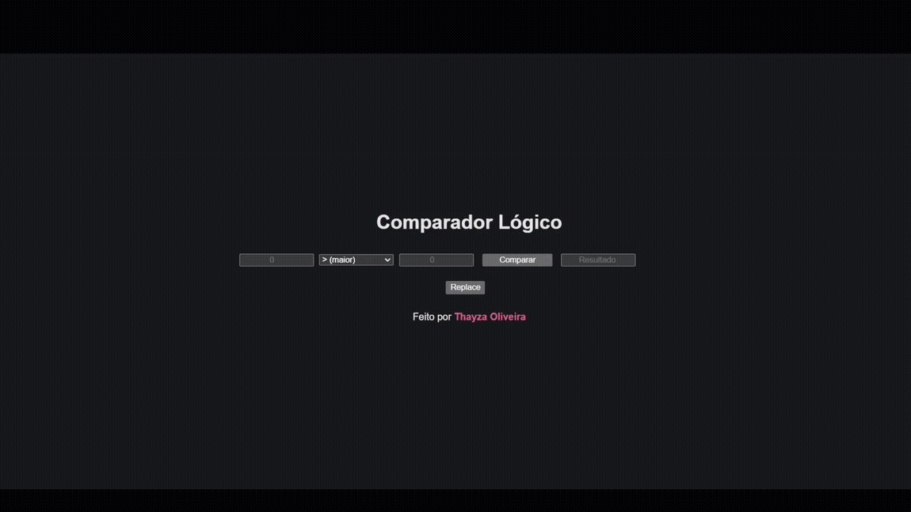

# <h1 align=center>Comparador Lógico</h1>

Desenvolvimento de um comparador lógico que utiliza dois números informados para comparar logicamente com os operadores: maior, menor, menor igual, maior igual, igualdade e diferente. Esse é um exercício do módulo de Lógica de Programação do curso de formação Santander Coders 2023 na trilha Angular.

 

#### <h3 align="center"> Esse projeto foi desenvolvido com </h3>

### 
 **HTML | CSS | JavaScript**

### <h3 align="center"> [Acesse meu perfil no Linkedin aqui](https://www.linkedin.com/in/tthayza-oliveira/) </h3>
